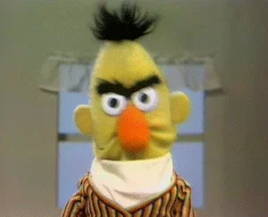

# BRUN0-Net
Big Recurrent Universal Network 0

## Task ❓

Questo progetto punta a completare una competition di Kaggle [Feedback Prize - Predicting Effective Arguments 📓](https://www.kaggle.com/competitions/feedback-prize-effectiveness), che consiste nel creare una rete neurale in grado di esprimere valutazioni riguardo alla correttezza di testi argomentativi scritti da studenti che vanno dalle maedie fino agli ultimi anni delle superiori.

## Dataset 🦼

Il dataset fornito da Kaggle presenta circa 3000 testi argomentativi di studenti statunitensi che variano in livello da medie a superiori.
Ogni testo è stato analizzato da esperti per estrapolarne elementi del discorso comunemente trovati in testi argomentativi, in particolare:

- `Lead`: ovvero un'introduzione che serve per catturare l'attenzione del lettore e indirizzarlo verso la tesi
- `Position`: un'opinione o conclusioni tratte sull'argomento portato
- `Claim`: un'affermazione che supporti la posizione
- `Counterclaim`: un'affermazione che confuta un'altra affermazione o fornisce una motivazione contraria alla posizione
- `Rebuttal`: una nuova affermazione che confuta la `Counterclaim`
- `Evidence`: idee a supporto della `Claim`
- `Concluding Statement`: una frase conclusiva che ribadisce le affermazioni

Ognuna di queste componenti è affiancata ad uno di tre giudizi che saranno le nostre label per la fase di training:

- `Ineffective`
- `Adequate`
- `Effective`

## Technologies & Skills :desktop_computer:

- Python 3.8
- Jupyter Notebooks
- Transformers
- BERT
- Tenorflow
- Keras
- Pandas
- Matplotlib
- Docker

Altissima conoscienza di Machine Leanring & Deep Leanring 😲

## Sviluppo :light_rail:

- Interiorizzato funzionamento dei Transformers
- Analizzato nei minimi dettagli il dataset fornito (non ha più segreti per noi 🚀)
- GRAFICI 📈
- Procedura di PreProcessing del dataset OTTIMIZZATA e VELOCE
- Suddivisione Train - Validation intelligente 🤖
- GIGANTESCA lista di modelli diversi tra cui scegliere :100:
- Affrontato problema NON ALLENAMENTO (ANNICHILITO) 🤯
- ANCORA ALLENAMENTO ANCORA PIÙ INTENSIVO 🤖🔥🤯🤯
- DI NUOVO GRAFICI 📈📈
- Risultati ultra-performanti 🎱

## Conclusione

Siamo riusciti ad ottenere il MIGLIORE modello di NLP mai visto nella storia 😲🤯!!!
